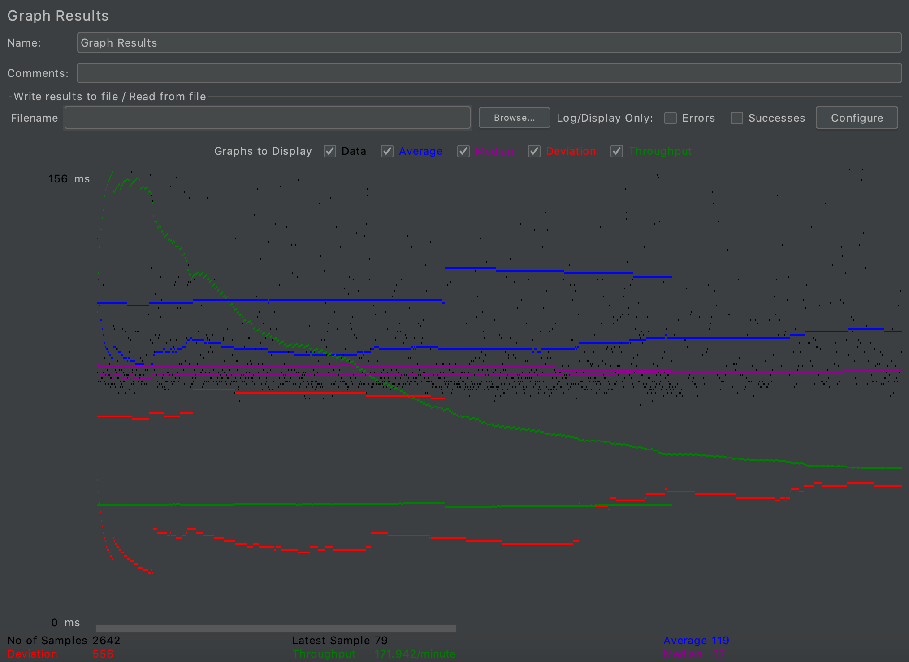
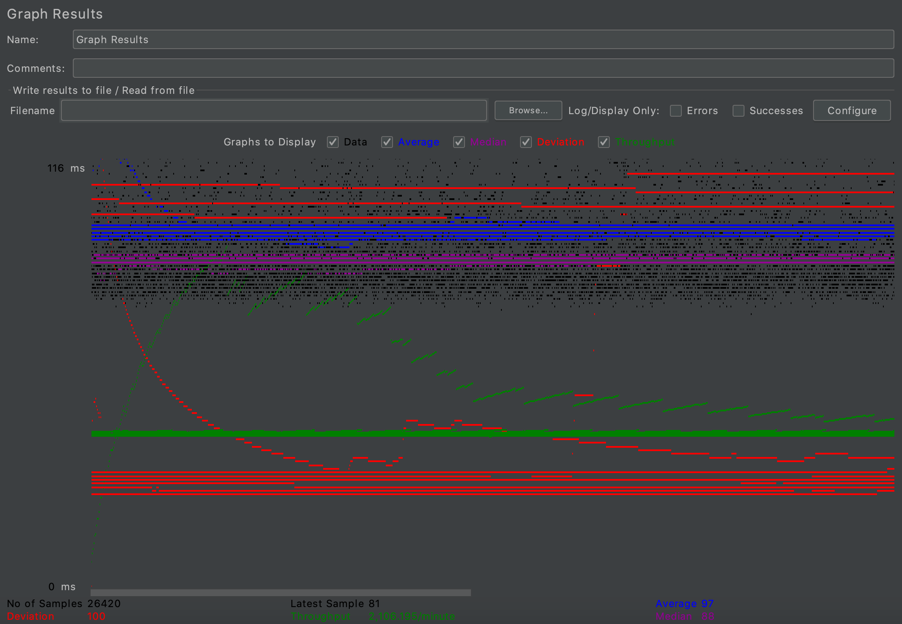
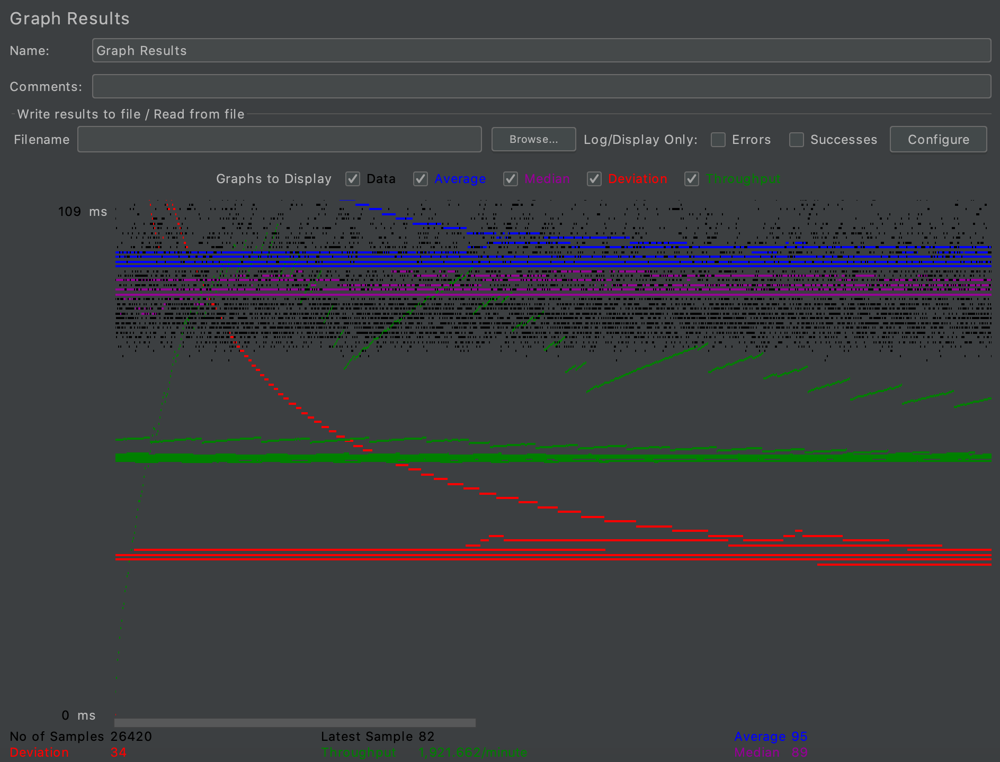
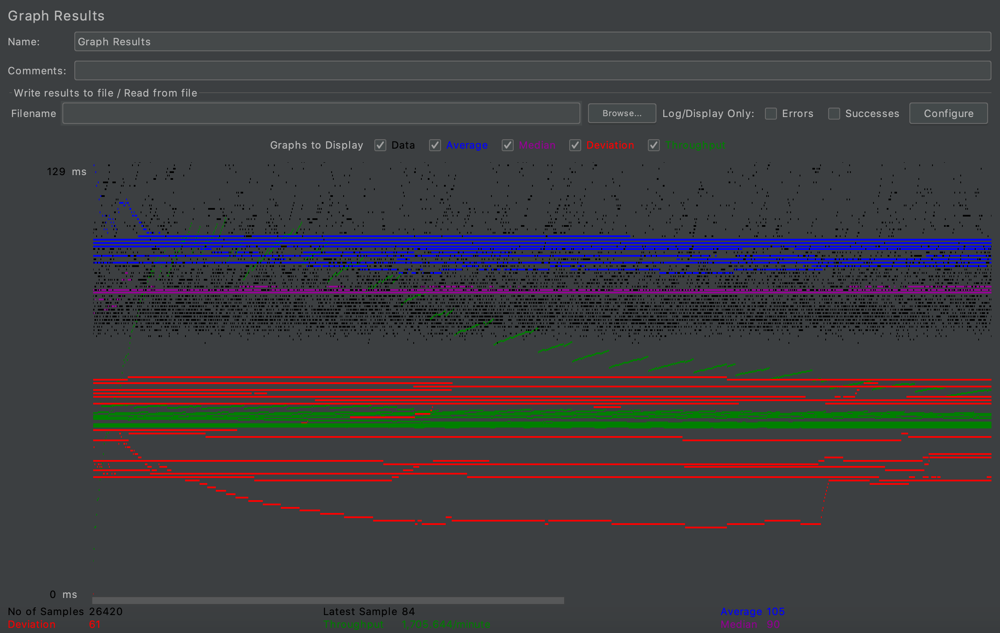
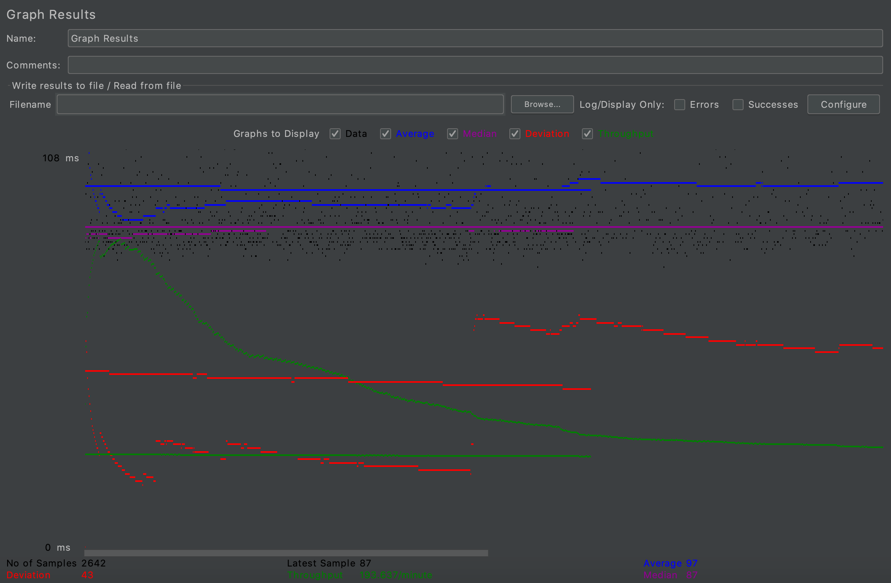
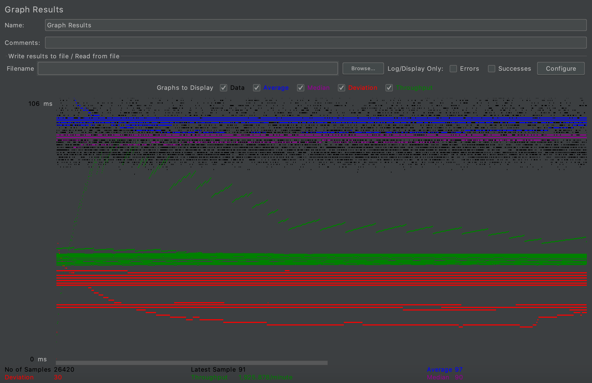

- # General
    - #### Team#: cs122b-spring20-team-38
    
    - #### Names: Xuan Liu, Hongen Lei
    
    - #### Project 5 Video Demo Link: 
    https://youtu.be/k7ZCYIkpo6Y

    - #### Instruction of deployment: 
	1. Clone this repository
	2. Locate "Project5-Master" and "Project5-Slave". Then build the war file for each.
	3. Deploy the Master's war file to the master instance that has already been set up.
	4. Deploy the Slave's war file to the slave instance that has already been set up.
	5. Modify the Balancer instance to balance the assignment of connections between the two servers.

    - #### Collaborations and Work Distribution:
       - Hongen Lei: Implemented Connection Pooling. Modified Project 5 to become Master and Slave Project.  Implemented Google Cloud Balancer.
       - Xuan Liu: Implemented Balancer, Master, and Slave instances. Created Log Processing Script. Produced the JMeter TS/TJ Time Measurement Report.

- # Connection Pooling
    - #### Include the filename/path of all code/configuration files in GitHub of using JDBC Connection Pooling.
        ##### Configuration files:
            Project5\web\META-INF\context.xml
            Project5\web\WEB-INF\web.xml
            Project5-Slave\web\META-INF\context.xml
            Project5-Slave\web\WEB-INF\web.xml

	    ##### Code files:
            Project5\src\AddMovieServlet.java
            Project5\src\AddStarServlet.java
            Project5\src\AdminLogin.java
            Project5\src\CategoryResultServlet.java
            Project5\src\LoginServlet.java
            Project5\src\MetaDataServlet.java
            Project5\src\MovieSuggestion.java
            Project5\src\PaymentServlet.java
            Project5\src\ResultServlet.java
            Project5\src\SingleMovieServlet.java
            Project5\src\SingleStarServlet.java
		
    
    - #### Explain how Connection Pooling is utilized in the Fabflix code.
    
    - #### Explain how Connection Pooling works with two backend SQL.
    

- # Master/Slave
    - #### Include the filename/path of all code/configuration files in GitHub of routing queries to Master/Slave SQL.
        ##### Master Configuration files:
            Project5-Master\web\META-INF\context.xml
            Project5-Master\web\WEB-INF\web.xml
           
        ##### Master Code files:
            Project5-Master\src\AddMovieServlet.java
            Project5-Master\src\AddStarServlet.java
            Project5-Master\src\AdminLogin.java
            Project5-Master\src\CategoryResultServlet.java
            Project5-Master\src\LoginServlet.java
            Project5-Master\src\MetaDataServlet.java
            Project5-Master\src\MovieSuggestion.java
            Project5-Master\src\PaymentServlet.java
            Project5-Master\src\ResultServlet.java
            Project5-Master\src\SingleMovieServlet.java
            Project5-Master\src\SingleStarServlet.java
         
        ##### Slave Configuration files:
            Project5-Slave\web\META-INF\context.xml
            Project5-Slave\web\WEB-INF\web.xml
           
        ##### Slave Code files:
            Project5-Slave\src\AddMovieServlet.java
            Project5-Slave\src\AddStarServlet.java
            Project5-Slave\src\AdminLogin.java
            Project5-Slave\src\CategoryResultServlet.java
            Project5-Slave\src\LoginServlet.java
            Project5-Slave\src\MetaDataServlet.java
            Project5-Slave\src\MovieSuggestion.java
            Project5-Slave\src\PaymentServlet.java
            Project5-Slave\src\ResultServlet.java
            Project5-Slave\src\SingleMovieServlet.java
            Project5-Slave\src\SingleStarServlet.java
    - #### How read/write requests were routed to Master/Slave SQL?
        - In the Master Instance, read and write requests are sent directly to the SQL without rerouting.
        - In the Slave Instance, we have 2 MYSQL resources in the context file. One refers to the MYSQL server of the Slave instance. Another refers to the master MYSQL server. All the read requests will be sent to the Slave MYSQL server. And all the write requests are sent to the Slave MYSQL server.
    

- # JMeter TS/TJ Time Logs
    - #### Instructions of how to use the `log_processing.*` script to process the JMeter logs.
        - After the test, the "time_log.txt" file is stored in tomcat/webapps/Project5. The processing scipt is in the [logProcess](https://github.com/UCI-Chenli-teaching/cs122b-spring20-team-38/tree/master/logProcess) Project, running processLog.java will print the average TS and TJ. 
        - Note: you need to change the file path in processLog.java.

- # JMeter TS/TJ Time Measurement Report

| **Single-instance Version Test Plan**          | **Graph Results Screenshot** | **Average Query Time(ms)** | **Average Search Servlet Time(ms)** | **Average JDBC Time(ms)** | **Analysis** |
|------------------------------------------------|------------------------------|----------------------------|-------------------------------------|---------------------------|--------------|
| Case 1: HTTP/1 thread                          |    | 119                        | 2.937223                              | 2.904217                   | Compared to 10 thread, 1 thread has more average query time, less TJ and TS|
| Case 2: HTTP/10 threads                        |    | 97                         | 5.747524                              | 5.723286                   | TJ and TS just account a little portion of average query time|
| Case 3: HTTPS/10 threads                       |    | 95                       | 5.917631                                | 5.892317                   | Compared to HTTP, HTTPS has less average query time, more TJ and TS|
| Case 4: HTTP/10 threads/No connection pooling  |    | 105                         |6.932574                              | 6.911779                   | If no connection pooling, it takes more average query time, TJ and TS|

| **Scaled Version Test Plan**                   | **Graph Results Screenshot** | **Average Query Time(ms)** | **Average Search Servlet Time(ms)** | **Average JDBC Time(ms)** | **Analysis** |
|------------------------------------------------|------------------------------|----------------------------|-------------------------------------|---------------------------|--------------|
| Case 1: HTTP/1 thread                          |    | 97                        | 3.458292                                  | 3.393989                        | Compared to Single-instance, the Scaled Version has less average query time, more TJ and TS|
| Case 2: HTTP/10 threads                        |    | 97                         | 4.156881                                  | 4.132455                        | Compared to Single-instance, the Scaled Version has similar average query time, less TJ and TS|
| Case 3: HTTP/10 threads/No connection pooling  |    | 119                         | 2.546731                                  | 2.509453                        | Compared to Single-instance, the Scaled Version has similar average query time, less TJ and TS|
